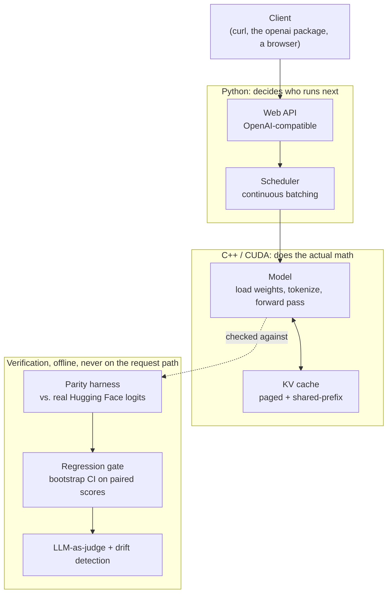

# Kiln

Kiln is an LLM inference engine built from scratch: point it at a model's
raw weights and it serves chat-style requests, many at once, remembering
what it's already read, with the option to shrink the model for speed.
Python handles traffic and scheduling; C++/CUDA does the actual math. Every
component is checked against a reference implementation before it's
trusted, and every limitation is written down rather than hidden.

This is a from-scratch learning project, not a production system. The
point was to build and understand every layer of an inference stack that
normally comes pre-packaged (vLLM, TensorRT-LLM, llama.cpp), and to prove
each piece works instead of assuming it does.

## How it fits together



The split is deliberate, not a compromise: deciding *who runs next* is a
policy question (needs to be easy to get right, not fast), while *running
the model* is a raw-speed question. That's the same Python-front /
C++-back split PyTorch, vLLM, and TensorRT-LLM actually use. The
verification plane sits outside the request path on purpose: it's what
turns every number below from "trust me" into "here's the diff."

## What it can do

- Load a model's raw weights and run a real forward pass (attention,
  RMSNorm, SwiGLU, RoPE), written from scratch and checked against a real
  Hugging Face model, not just against itself.
- Cache what it's already computed instead of redoing it every token, with
  a paged allocator and copy-on-write sharing so identical prompt prefixes
  across conversations share one copy of memory.
- Serve several conversations at once with continuous batching: new
  requests join and finished ones leave without anyone waiting on the
  slowest one in the batch.
- Shrink the model's weights (INT8/INT4) for less memory, with the
  accuracy cost measured against an independent reference quantizer, not
  assumed.
- Speed up generation with speculative decoding (a small model guesses
  ahead, the real model checks the guesses in one pass), proven, not just
  claimed, to produce token-for-token identical output to plain greedy
  decoding.
- Serve all of the above over an OpenAI-compatible HTTP API, so existing
  tools work against it unmodified.

## Measured results

Every row is real and reproducible: `PYTHONPATH=. python3 bench/run_benchmarks.py`.
There's no GPU in this dev environment, so these numbers run on CPU against
a small, **randomly-initialized (untrained)** model: honest hardware, not
a production claim.

| Optimization | Metric | Result |
|---|---|---|
| Naive (recompute every step) | decode throughput | 254.7 tok/s |
| + KV cache | decode throughput | 2,843 tok/s (**11.2×**) |
| + continuous batching | wall-clock, mixed workload | **1.42×** faster than static batching |
| + paged KV cache | max concurrent sequences, fixed memory | 4 → 21 → 62 (contiguous → paged → paged+shared-prefix) |
| + INT8 quantization | memory · reconstruction error | **3.76×** smaller · MSE 3.5×10⁻⁵ |
| + speculative decoding | output correctness | **exact**: token-for-token identical to greedy decoding, by construction |

Two rows worth a real explanation instead of a footnote: INT8 shows no CPU
speedup because the *speed* win comes from an INT8 GPU kernel. That kernel
passes correctness tests on CPU-vs-GPU and now has a real, GPU-measured
speed number too (**1.60×**, see below), just not one that belongs in a
CPU-only table. Speculative decoding's call-reduction is 1.0× here because the
draft and target are both randomly-initialized: two random models rarely
agree, but the thing that's actually proven (exact output equivalence,
by construction of the rejection-sampling rule) doesn't depend on that.

The paged-cache sharing path also has its own seeded benchmark:
`cmake --build build --target kiln_prefix_cache_benchmark && ./build/kiln_prefix_cache_benchmark`
runs 80 synthetic conversations sharing a system prompt, **248/252 prefix-block
lookups hit (98.4%)**.

Real-model correctness: two structurally different Llama-family checkpoints
(`SmolLM2-135M-Instruct`, `SmolLM2-360M-Instruct`, different depth and
GQA ratio) each pass a full 10-prompt final-logit comparison against Hugging
Face, worst-case difference ~6×10⁻⁵ (FP32-vs-BF16 rounding, not a real
divergence). Run it: `pip install -e '.[oracle]'` then
`PYTHONPATH=. python tools/hf_parity.py --model-dir PATH --prompts-file tools/fixtures/hf_parity_prompts.txt`.

Real GPU numbers, from a real NVIDIA GPU (GeForce GTX 1660 Ti Mobile,
compute capability 7.5), after Kaggle (blocks performance counters outright)
and eleven-plus GCP attempts (quota, then zone exhaustion, then four repeated
preemptions) all failed to produce them: **INT8-vs-FP32 GEMM speedup,
1.60×**, measured directly (`fp32_median_ms=0.488616 int8_median_ms=0.305316`,
`kiln_int8_gemm_cuda_benchmark`), lower than a datacenter GPU with
dedicated INT8 tensor cores would show, since this consumer Turing part
accelerates INT8 via DP4A instructions, not tensor cores, and that's
reported as measured, not adjusted upward. **Nsight Compute profiling** of
all 33 kernel launches in a real prefill pass: every kernel's Compute and
Memory Throughput sit under ~3.5%, and Nsight's own launch-statistics
warning names why directly: *"This kernel grid is too small to fill the
available resources on this device... 0.0 full waves across all SMs."*
That's an honest, expected result for a correctness-test-sized (3-token)
fixture: launch-overhead-bound, not compute-bound. Full writeup:
`docs/defense.md`, Phase 30.

## What's not done, and why

- **Tensor parallelism is a single-process simulation** of sharded ranks,
  tested against real model weights, but never run across actual separate
  GPUs. No multi-GPU machine has been available.
- **Per-layer parity** is a real pass/fail check, not just a printed
  number: `tools/hf_parity.py` fails loudly (nonzero exit) if any layer's
  hidden-state difference from Hugging Face exceeds a threshold. That
  threshold is looser than the final-logit one on purpose: FP32-vs-BF16
  rounding compounds across depth (observed up to ~2.7×10⁻² even though the
  final logit stays ~10⁻⁵), and both checkpoints pass it.
- **No live deployment, no real users, no real incident.** Deliberately
  never simulated. Faking a launch story would be the one dishonest thing
  this project could do to look more finished than it is.

## What it's made of

| Piece | Where | Built from |
|---|---|---|
| Load model weights | `csrc/loader/` | memory-mapped read, small header describing tensor layout |
| Tokenizer | `csrc/tokenizer/` | byte-pair encoding, same approach real tokenizers use |
| Forward pass | `csrc/executor/` | GEMM (via cuBLAS), RMSNorm, attention, SwiGLU, hand-written and chained |
| KV cache | `csrc/kv/` | contiguous version, plus a paged + copy-on-write shared-prefix version |
| Sampling | `csrc/executor/sampler.*` | greedy argmax, or temperature/top-p |
| Quantization | `csrc/quant/` | per-block scale + INT8/INT4 values |
| Scheduler | `kiln_py/scheduler/` | continuous batching (Orca-style) |
| Speculative decoding | `kiln_py/runtime/speculative_decode.py` | small draft model, checked in one pass by the real model |
| Web API | `kiln_py/api/` | OpenAI-compatible request/response shapes |

CUDA specifics, precisely: attention, RMSNorm, and the sampler are
hand-written raw CUDA using warp-shuffle reductions. RoPE exists in both
raw CUDA and Triton, specifically to have a measured answer for "why not
Triton for everything." GEMM goes through cuBLAS deliberately: beating it
by hand is a multi-year compiler project, not a useful place to spend time.

## Try it

```bash
brew install cmake ninja nlohmann-json icu4c pybind11   # macOS build deps

pip install -e .                                          # builds the C++ side
cmake -B build -G Ninja && cmake --build build             # or build the C++ side directly
ctest --test-dir build --output-on-failure
PYTHONPATH=. python3 -m pytest tests/py                     # Python side

bash demo.sh                                                # full five-minute tour
```

Then `curl http://localhost:8420/v1/completions -d '{"prompt": "hi", "max_tokens": 8}'`
against the running API.

## Where things live

```
csrc/            C++/CUDA, the actual math
kiln_py/         Python, requests, scheduling, accounts, the web API
tests/           cpp/ (GoogleTest), py/ (pytest)
tools/           reference-model comparison script, quantizer cross-check
docs/            adr/ (why each decision), learning/ (derivations, phase by
                 phase), writeups/ (longer explanations), walkthrough.md,
                 defense.md (what was built + what it cost, per phase),
                 correctness.md (real bugs found and how), postmortems/
deploy/          Dockerfile, docker-compose (engine + Prometheus + Grafana)
demo.sh          scripted end-to-end tour
```

For more detail: `docs/walkthrough.md` is the full plain-language tour,
`docs/defense.md` is the phase-by-phase build log with exact costs,
`docs/correctness.md` is a running list of real bugs this project found in
itself, and `docs/writeups/` has longer explanations of the three most
interesting parts (the shared-memory cache, the testing philosophy, and
what quantization actually costs).
