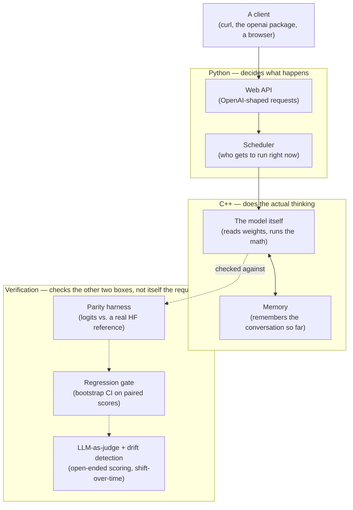

# Kiln

Kiln is an LLM serving engine built from scratch — the same kind of
system that runs behind a chat product, but written by hand instead of
imported. Python handles the traffic (requests, scheduling, accounts);
C++ does the actual thinking (reading the model's weights, running the
math, remembering the conversation). Every piece is checked against a
reference implementation before it's trusted, and every shortcut this
project takes is written down plainly, not hidden.

**One sentence:** point Kiln at a model's raw weights, and it serves
chat-style requests — many at once, remembering what it's already read,
with the option to shrink the model down for speed — the way a real,
production LLM server works, minus the parts that need a rented GPU or a
real audience to build honestly.

## The delta table

Every row below is a real, reproducible measurement from
`bench/run_benchmarks.py` — run it yourself with `PYTHONPATH=.
python3 bench/run_benchmarks.py`. There is no GPU in this environment, so
this all runs on CPU against a small, **randomly-initialized (untrained)**
model — real numbers, honest hardware, not the production claim. The
metric used per row is whichever one that optimization actually changes;
forcing every row into the same column would be less honest, not more
rigorous.

| Optimization | What it actually changes | Measured result |
|---|---|---|
| Naive (recompute every step) | decode throughput | **254.7 tok/s** |
| + KV cache | decode throughput | **2,843 tok/s** (**11.2×**) |
| + KV cache (representative path) | TTFT / TPOT, p50 / p99, n=20 trials | TTFT 2.14 / 2.47 ms · TPOT 0.28 / 0.31 ms |
| + continuous batching | wall-clock time, mixed-length workload (6 requests) | **1.42×** faster than static batching |
| + paged KV cache | max concurrent sequences at fixed memory | contiguous **4** → paged **21** → paged+shared-prefix **62** |
| + INT8 quantization | memory footprint · reconstruction error | **3.76×** smaller · MSE **3.5×10⁻⁵** (CPU speed *not* faster — no INT8 kernel; see below) |
| + speculative decoding | target-model calls per token | **1.0×** call reduction here (see below) · **exact**: seeded output token-for-token identical to greedy decoding, proven by the rejection-sampling construction, not measured by luck |

The paged-cache sharing path also has a separate seeded workload:
`cmake --build build --target kiln_prefix_cache_benchmark &&
./build/kiln_prefix_cache_benchmark`. It ran 80 synthetic conversations
with a shared system prompt and four prompt variants, and measured **248
hits in 252 prefix-block lookups (98.41%)**. This is a local, synthetic
cache-mechanism measurement -- not a rate from real users or real traffic.

**Two rows that need explaining, not hiding:**

- **INT8 shows no CPU speedup.** The memory reduction and the accuracy
  cost are real, measured numbers. The *speed* win real INT8 quantization
  provides comes from an INT8 GPU kernel — this project's Phase 7 FP32
  kernels have compiled and passed CPU-vs-GPU correctness tests on a Kaggle
  P100, but there is no INT8 GPU kernel or performance measurement yet.
  Reporting a CPU number as if it
  demonstrated the GPU win would be the fabrication this project
  specifically refuses to do.
- **Speculative decoding's call-reduction number is 1.0× (zero) here, and
  that's the correct, honest result for this specific draft/target
  pairing — not a claim that the mechanism doesn't work.** Its speed
  payoff depends entirely on the draft model's guesses actually landing,
  and two independently, randomly-initialized models have essentially no
  reason to agree (about a 1-in-1000 chance per token, at this toy
  vocabulary size). What *is* proven, independent of which models are
  paired: the rejection-sampling acceptance rule makes the output
  distribution exact by construction, and the test checks this directly —
  seeded speculative decoding produces token-for-token identical output to
  seeded greedy decoding, every time. The two claims are separate on
  purpose: "does it change your answer" (no, proven) and "does it make
  this particular pairing faster" (not with two random models, and that's
  expected, not a bug).

See `BENCHMARKS.md` for the full per-phase history and `BENCHMARK.md` for
the roofline / arithmetic-intensity analysis of why decode and prefill
behave so differently in the first place.

## What actually works right now

Kiln can load a model, turn text into the numbers it understands and
back, generate new text one word at a time while remembering everything
it's already read, serve several people at once fairly, and answer over
a normal web API that other tools (like the `openai` Python package)
already know how to talk to. On top of that: a memory system that shares
identical prompts between conversations instead of storing them twice; a
way to shrink the model's numbers down for less memory use; and a proven
(not just claimed) trick for generating text faster using a second,
smaller model as a scout.

**What doesn't work yet, and why, in one line each:** the raw CUDA kernels
now compile and pass small CPU-vs-GPU correctness tests on Kaggle P100 and
T4 GPUs; the T4 run also gives a narrow raw-CUDA-vs-Triton RoPE benchmark.
A device-resident CUDA prefill and cached-decode path have also matched the
CPU model's complete logits on a T4. Tensor parallelism is tested against the
real model's own weights, but as a single-process simulation of sharded
ranks, not distributed across actual separate GPUs -- no multi-GPU machine
has been available to run it on real hardware. Nsight profiling and a
measured real-hardware INT8-vs-FP32 GEMM speedup both remain blocked
specifically on GPU access: Kaggle blocks performance counters outright, its
free sessions land on a P100 one minor compute-capability version below
what INT8 tensor cores require, and eleven separate attempts at a GCP GPU VM
across as many zones all failed with `ZONE_RESOURCE_POOL_EXHAUSTED` before
creating anything billable. Two real Llama-family
checkpoints have now passed a full 10-prompt final-logit comparison each
(details below), but per-layer parity is available through a debug-only
capture path rather than checked by default, and the named 10,000-string
tokenizer fixture is conformant on both checkpoints' tokenizers. And
nobody has actually used this — there's no live website, no real users, no
incident that ever happened — because that would take an actual public
launch, which is a decision for later, not something to fake. Every one of
these is written down in detail, not glossed over — see **Honest status**
below.

## How it fits together



**Why split it this way?** Deciding *who gets to talk to the model next*
is a policy question — it doesn't need to be fast, it needs to be easy to
get right and easy to change. Actually *running* the model is a raw-speed
question. Keeping those two concerns in two different languages, talking
through one narrow, well-defined bridge, is exactly how real production
engines (the ones this project is modeled on) are built — it's not a
compromise, it's the standard shape of the thing.

The verification plane sits outside that request path on purpose: it
never runs on the hot path, and it's what turns every claim in the delta
table below from "trust me" into "here's the diff." The parity harness
checks the C++ compute layer against a real Hugging Face reference; the
regression gate and drift detector check whether a *change* to either
side made things measurably better, worse, or just noisier.

## The big picture (what each piece is for)

- **Reading a model's weights and turning text into numbers.** A model
  file is opened without copying it into memory twice, and a sentence is
  turned into a list of numbers (and back) the same way real tokenizers
  do it.
- **The forward pass.** The actual "thinking" — read the conversation so
  far, decide what matters, produce a guess at the next word. Written
  from scratch, checked piece by piece.
- **Remembering the conversation (the cache).** Redoing all that thinking
  for every single new word would be wasteful — the cache remembers what
  was already computed, and a second, more advanced version shares
  identical prompts between separate conversations instead of storing
  them twice.
- **Serving many people at once.** New conversations join in and
  finished ones leave immediately, instead of everyone waiting for the
  slowest conversation in the batch to finish before anyone new can
  start.
- **Shrinking the model down (quantization).** Trading a little precision
  in the model's numbers for a lot less memory — with the accuracy cost
  measured, not assumed.
- **A faster way to generate text (speculative decoding).** A smaller,
  faster model guesses several words ahead; the real model checks all the
  guesses in one pass. Proven — not just claimed — to produce the exact
  same answer as not using the shortcut at all.
- **Checking whether a change made things better or worse.** Infrastructure
  for comparing two versions honestly, using statistics that can tell a
  real improvement apart from random noise — including an LLM-as-judge
  scorer for open-ended answers and drift detection for a stream of scores
  drifting away from a baseline.

## What each piece is actually made of (for anyone reading the code)

| Piece | Where | What it's built from |
|---|---|---|
| Reading model weights | `csrc/loader/` | opens the file without copying it, reads a small directory describing where each number lives |
| Turning text into numbers | `csrc/tokenizer/` | the standard "merge common pairs of letters together" approach real tokenizers use |
| The forward pass | `csrc/executor/` | matrix multiplication, a normalizing step, the "attention" mechanism, and a small decision-making network — chained together |
| Remembering the conversation | `csrc/kv/` | a straightforward version, and an advanced version that shares memory between conversations and only copies it the moment two conversations actually diverge |
| Choosing the next word | `csrc/executor/sampler.*` | always picking the best guess, or picking with some controlled randomness |
| Shrinking the model | `csrc/quant/` | representing many numbers with one shared "how big are these, roughly" value plus small individual differences |
| Deciding who runs next | `kiln_py/scheduler/` | a waiting line and a running list, moving people between them as room opens up |
| The faster generation trick | `kiln_py/runtime/speculative_decode.py` | a small model guesses, a big model checks all the guesses in one go |
| The web API | `kiln_py/api/` | matches the shape of OpenAI's own API, so existing tools work against it unmodified |

## Honest status

Every claim above has a receipt. `docs/walkthrough.md` has the full,
plain-language tour; `docs/defense.md` explains, phase by phase, what was
built and exactly what it cost; `docs/correctness.md` is a running list
of real bugs this project found in itself (and how); `BENCHMARKS.md` has
the itemized, nothing-hidden list of what's actually been measured versus
what's honestly still missing; `docs/interview-prep.md` has the prepared
answers to the specific questions this project invites. Nothing here
claims more than what was actually run and checked.

CPU-only reference checks now exist against two real, structurally different
Llama-family checkpoints: `HuggingFaceTB/SmolLM2-135M-Instruct` and
`HuggingFaceTB/SmolLM2-360M-Instruct` (different hidden size, depth, and
grouped-query-attention ratio). All 10 prompts in
`tools/fixtures/hf_parity_prompts.txt` (short/long sequences, Unicode,
punctuation) produce matching top-1 next-token IDs between Hugging Face FP32
and Kiln on both checkpoints, with final-logit differences in the low
10⁻⁵ range (worst case **6.63×10⁻⁵** on the 135M model, **5.07×10⁻⁵** on the
360M model). This is two checkpoints and ten prompts each, not a complete
parity proof across every checkpoint and input that exists. Run it after
`pip install -e '.[oracle]'` with `PYTHONPATH=. python tools/hf_parity.py
--model-dir PATH --prompts-file tools/fixtures/hf_parity_prompts.txt`.

As of this writing: the checked-in suites include the C++ tests (including
memory-safety tooling, and 61/61 on a real Kaggle GPU with `KILN_BUILD_CUDA`
on) and the Python API tests. The whole thing has also been built and run
inside a real Docker container.

## Try it

```
pip install -e .                                          # builds the C++ side
cmake -B build -G Ninja && cmake --build build             # or, to just run the C++ tests directly
ctest --test-dir build --output-on-failure
PYTHONPATH=. python3 -m pytest tests/py                     # the Python side

bash demo.sh                                                # the full five-minute tour
```

Then `curl http://localhost:8420/v1/completions -d '{"prompt": "hi", "max_tokens": 8}'`
against the running API, or read `docs/writeups/` for three longer
explanations of the most interesting parts (the shared-memory conversation
cache, the "how do we know it's still right" testing philosophy, and what
shrinking a model actually costs).

## Where things live

```
csrc/            the C++/CUDA side — everything that does the actual math
kiln_py/         the Python side — requests, scheduling, accounts, the web API
tests/           cpp/ (GoogleTest) and py/ (pytest)
tools/           the reference-model comparison script, a quantizer cross-check
docs/            adr/ (why each big decision was made), learning/ (derivations,
                 phase by phase), writeups/ (the longer explanations),
                 walkthrough.md, defense.md, correctness.md, postmortems/
deploy/          Dockerfile, docker-compose (engine + Prometheus + Grafana)
demo.sh          the scripted end-to-end tour
```

The project's own phase-by-phase record — what was built, why, and what
it cost — lives in `docs/defense.md`, `docs/correctness.md`, and
`docs/learning/`.
